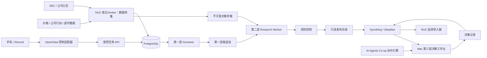
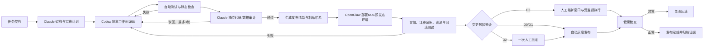

# 美股价值投资三层系统工程实施方案

## 1. 执行结论

在当前设备、网络和既有软件条件下，本系统具备研究型 MVP 的工程可行性。推荐采用以下总体部署：

- **NUC 负责第一层与第二层：** 全市场数据更新、初筛、财报采集、确定性计算、AI 研究任务、证据归档和持续监测；
- **Mac 负责第三层：** 候选比较、双模型研讨、价格与仓位决策、人工审批和最终决策记录；
- **OpenClaw＋Discord 作为控制面：** 提交预定义任务、查询状态、接收失败和待审批通知，不直接拼接或执行任意 shell 命令；
- **PostgreSQL＋Parquet/DuckDB 作为权威数据面：** 任务、状态、评分、版本和证据索引以 NUC 数据库为准；
- **Syncthing＋Obsidian 作为文档交换面：** 只同步不可变的候选快照、研究报告、决策记录和审计摘要，不同步数据库、队列、锁文件、密钥或运行缓存；
- **现有 AI Agents Co-op 作为协作引擎来源：** 复用双模型研讨、人工关卡、插话、总结、分歧监测和过程留痕；不复用其单文件任务存储和任意 shell 命令执行方式作为生产内核；
- **系统开发也由 AI Agents Co-op 驱动：** Claude负责方案与独立审计，Codex负责隔离工作区编码和修复，OpenClaw负责NUC预发布部署、冒烟测试和受控发布；低风险变更自动流转，高风险变更只保留一个必要的生产批准点；
- **不连接自动下单：** 在预登记、样本外、12—24 个月前瞻运行验证和36—60个月经济验证完成前，系统只生成研究与纸面决策；任何阶段均无券商交易权限。

推荐把三层实现为**一个新的单一代码仓库（monorepo）中的三个独立应用**，共用版本化数据契约和证据底座。这样既保持业务边界，又降低单人或小团队维护三个仓库、三套发布流程的成本；这不意味着把三个应用做成不可拆分的单体服务。

## 2. 设计依据与适用边界

### 2.1 业务基线

本方案以 [《美股价值投资三层筛选与决策系统 v0.3》](./美股价值投资三层筛选与决策系统-外部研讨方案-v0.3.md) 为业务规则基线，保持以下三道边界：

```text
第一层不能证明低估，只能发现“值得研究的异常”。

第二层不能决定仓位，只能形成可证伪的价值与风险判断。

第三层不能改变事实，只能在既定证据下分配资本和限制损失。
```

量化表达保持：

| 层级 | 工程输出 |
| --- | --- |
| 第一层 | 0—100 初筛分、行业/历史分位、硬门槛、数据等级、冷门标签和解释卡 |
| 第二层 | Q 质量评级与区间、V 估值评级与区间、R0—R3 风险等级、三情景估值、反向 DCF 和证伪条件 |
| 第三层 | S0—S5 决策状态、价格带、悲观损失、仓位上限、升级/降级/退出条件和复核日期 |

### 2.2 当前基础条件

| 条件 | 工程判断 |
| --- | --- |
| NUC i7-9850H，6核12线程 | 足以完成美股全市场结构化筛选和2个第二层案例并行；不适合运行大型本地模型 |
| 62 GiB 内存 | 资源充足，可为宿主Docker研究服务设置16 GiB目标预算和24 GiB硬上限，同时保留现有服务余量 |
| 2 TB NVMe，约5%使用 | 足以保存热数据、数据库、财报正文、快照和近期模型产出 |
| NAS 15 TB，使用率74% | 可作为加密备份和冷归档目标，但应设置80%预警和保留策略，不能作为唯一备份 |
| 无独立 GPU | 不影响SEC/XBRL、因子计算和云端模型调用；本地大模型与大规模OCR暂不纳入MVP |
| 未配置 Swap | 不构成当前阻塞；建议增加8—16 GiB zram作为突发内存保护 |
| 无磁盘加密 | 公共财报风险有限，但模型凭据、研究结论和未来组合记录需另行加密；长期在系统迁移时采用LUKS |
| OpenClaw＋Discord 已运行 | 可复用为控制面，但必须改为白名单任务API，不得继续扩大任意执行权限 |
| KVM/libvirt 已运行 | 保留现有 `jason-vm`；研究系统MVP不新增VM，只有满足隔离触发条件时才启用后备VM路线 |
| Syncthing 跨设备同步 | 适合传递报告，不适合作为实时数据库或并发任务队列 |
| AI Agents Co-op 已成熟运行 | 适合第三层和第二层复审；现有存储、权限和并发模型需抽取改造 |

### 2.3 设计假设

以下内容需要在实施前核验，但不阻碍总体设计：

- 宿主持续高load的来源，以及 `jason-vm`、Docker、cron和其他自动化各自的CPU与I/O占用；
- cloudflared 当前所有 published routes、Access policy 和 service token；
- SSH、Syncthing、sing-box 各监听端口是否经过路由器或隧道暴露到公网；
- 现有交易自动化使用的 Linux 用户、密钥目录和 Docker/VM 边界；
- 第一层价格、公司行动、退市收益和分析师覆盖度所采用的数据供应商及许可；
- GPT、Claude 和 OpenClaw 的账号并发、费用和速率限制；
- PC 是否只查看报告，还是未来参与本地模型或批量回测。

这些项目必须形成只读资产清单，不在未核验前假定安全。

## 3. 工程原则

### 3.1 控制面、数据面、文档面分离

```text
控制面：Discord / OpenClaw / 任务 API / 人工审批
数据面：PostgreSQL / Parquet / 原始财报对象 / 估值输入
文档面：Obsidian / Markdown / JSON 快照 / 审计摘要
```

三者只能通过版本化接口交接：

- Discord 命令只能创建或查询任务，不能直接修改研究结论；
- 模型只能读取任务分配的证据包，不能直接修改权威财务数据；
- Obsidian 中的报告是发布快照，不作为数据库回写来源；
- 人工修订必须通过第三层决策表单或受控覆盖接口写入，并生成新版本。

### 3.2 计算与判断分离

- 财务公式、行业路由、分位、DCF、反向 DCF、仓位约束全部由确定性代码计算；
- 模型负责解释、发现矛盾、生成悲观论点、提出待核验问题和比较备选假设；
- 模型不得自行重写输入数字；发现数字错误时生成 `data_issue`，由数据流程重算；
- 所有模型结论必须引用 `evidence_id`，无证据引用的结论默认低置信度；
- 硬门槛由规则引擎判定，不能被模型评分或人工总分覆盖；人工覆盖只能形成独立、有理由、有审批人的例外记录。

### 3.3 Point-in-time 和不可变版本

- 所有时间存储为 UTC，界面按 Melbourne 和 US/Eastern 展示；
- 财报最早可用时间为实际提交/接受时间后的下一交易日；
- 原始财报、结构化事实、价格、公司行动和模型提示词均保存来源时间和提取时间；
- 同一输入版本重复运行必须得到相同的确定性计算结果；
- 报告发布后不原地覆盖，修订生成新版本并保留旧哈希；
- 历史重述只能从重述公开时点起生效，不回填旧筛选运行。

### 3.4 默认拒绝与最小权限

- 未知数据口径、未知任务类型、未知项目路径和未知模型均默认拒绝；
- 研究服务没有交易凭据；
- 第一层没有模型写权限；
- 第二层分析模型默认只读；
- 第三层写权限仅限决策记录目录和受控API；
- 外部文档、财报附件和网页内容一律视为不可信数据，其中出现的“指令”不得被当作系统任务执行；
- 联网、写文件、调用其他Agent和执行程序分别授权，不通过一个笼统的“全自动”开关同时放开。

## 4. 目标部署拓扑



### 4.1 NUC 宿主机

宿主机承担：

- 现有libvirt/KVM与 `jason-vm`；
- nftables、防火墙和网络边界；
- OpenClaw Gateway 与 Discord 接入；
- Syncthing；
- cloudflared（仅在完成路由审计后使用）；
- 现有交易和其他自动化；
- 第一、二层Docker staging、宿主机监控和备份/归档触发。

研究业务代码、数据库和财报缓存运行在独立Compose项目、网络、卷和研究专用目录中，不挂载OpenClaw私有目录、交易目录或Docker socket。现有OpenClaw与Syncthing的root运行方式作为用户接受风险保留，但不因此扩大研究部署入口。

### 4.2 宿主Docker研究环境

MVP默认不新增 `value-research-vm`。第一层和第二层分别使用独立Compose项目：

| 资源/边界 | 初始设置 | 调整条件 |
| --- | ---: | --- |
| CPU | 总并发预算4个逻辑CPU | 第一周低并发观测后按实际运行时间调整 |
| RAM | 16 GiB目标预算、24 GiB硬上限 | 第二层并行案例出现证据充分的内存压力时调整 |
| 热数据 | NUC本地NVMe | 达到容量预警后扩容或归档冷分区 |
| 冷数据 | NAS研究专用目录 | 只保存校验完成的归档和备份，不承载数据库/WAL |
| 网络 | 独立Compose network | PostgreSQL、Qdrant和内部API不向LAN或公网发布 |
| 并发 | 第一层1；第二层1—2 | 不影响现有VM和自动化后再提高 |

宿主Docker内运行：

- PostgreSQL；
- 数据采集器；
- 第一层筛选服务；
- 第二层研究Worker；
- 任务API；
- 调度器；
- 报告生成器；
- 结构化日志和指标导出器。

只有归档任务获得NAS研究专用目录权限。所有研究容器禁止使用特权模式、host network、宿主PID/IPC命名空间和Docker socket，也不挂载交易密钥、OpenClaw私有目录或其他自动化任务目录。

若系统需要持续执行未经审计的任意代码、公开上传入口、不可信二进制、独立系统升级周期，或Docker资源竞争实际影响现有服务，再为VM后备路线建立独立D3方案。

### 4.3 Mac

Mac 运行：

- 现有 AI Agents Co-op；
- 新增第三层 `decision-studio` 或其适配器；
- Obsidian 文档库；
- 本地人工审批界面；
- 可选的候选横向比较、图表和研讨记录展示。

第三层默认读取已发布的第二层快照。若需要补充事实，通过任务API向NUC创建“补证”任务，不直接修改第二层结果文件。

### 4.4 PC 与手机

- PC：默认作为只读报告与Dashboard终端；若未来加入计算，作为独立Worker注册，不共享数据库文件；
- 手机：通过Discord提交白名单任务、查看状态和接收审批通知；不显示密钥、完整财报附件或敏感组合细节；
- 任何移动端指令都不能触发交易、系统升级、权限修改或任意服务器命令。

## 5. 新工程的仓库与应用划分

建议建立一个新仓库 `value-investing-system`，保留现有 AI Agents Co-op 仓库独立演进：

```text
value-investing-system/
  apps/
    screener/                 # 第一层应用
    research/                 # 第二层应用
    decision_adapter/         # 第三层与AI Agents Co-op适配
    control_api/              # OpenClaw/Discord受控任务API
    report_exporter/          # Markdown/JSON快照发布
  packages/
    domain/                   # Q/V/R/S、硬门槛、状态机
    connectors/               # SEC、价格、公司行动、数据供应商
    point_in_time/            # 时间可得性与重述规则
    scoring/                  # 第一层评分及解释桥
    valuation/                # 正常化、三情景DCF、反向DCF
    evidence/                 # 证据台账、哈希、引用解析
    workflow/                 # 队列、租约、重试、幂等
  schemas/
    candidate_manifest.schema.json
    research_snapshot.schema.json
    decision_record.schema.json
  migrations/                # PostgreSQL迁移
  prompts/                   # 版本化、只读提示词模板
  infra/
    compose/
    systemd/
    backup/
    firewall-examples/
  tests/
    unit/
    integration/
    golden_cases/
    point_in_time/
    security/
  docs/
    adr/                      # 架构决策记录
    runbooks/                 # 运维手册
```

现有 AI Agents Co-op 第一阶段不搬迁，只新增受控适配器。适配稳定后，再决定是否把其前端和工作流内核并入新仓库。

## 6. 共享技术底座

### 6.1 推荐技术选型

| 领域 | 选择 | 理由 |
| --- | --- | --- |
| 主要计算语言 | Python | 财务、XBRL、数据处理和估值生态成熟 |
| 任务与服务API | FastAPI 或等价轻量框架 | 明确Schema、自动文档、便于OpenClaw和Mac调用 |
| 权威事务数据库 | PostgreSQL 16或以上的固定版本 | 支持并发、审计、事务、JSONB和队列租约 |
| 全市场宽表与回测 | Parquet＋DuckDB | 单机分析快、可版本化、适合point-in-time快照 |
| 数据处理 | Polars/Arrow，必要时Pandas | 降低内存占用，便于列式计算 |
| 对象存储 | NVMe目录＋SHA-256寻址 | MVP无需新增MinIO复杂度；可日后平滑迁移S3兼容存储 |
| 任务队列 | PostgreSQL job表＋租约 | 当前规模无需Redis/Celery，减少额外服务和恢复复杂度 |
| 调度 | systemd timers＋数据库调度表 | 系统重启后可追踪，适合NUC长期运行 |
| 服务封装 | Docker Compose运行于研究VM | 固定依赖、便于备份和回滚；容器内使用非root用户 |
| 第三层协作 | 现有Node.js AI Agents Co-op＋适配器 | 最大化复用既有研讨和关卡能力 |

所有镜像和依赖锁定版本；升级先在测试数据副本运行，再进入维护窗口。

### 6.2 不引入 Redis 的原因

当前预计的并发仅为：

- 1个第一层全量或增量任务；
- 最多2个第二层公司研究任务；
- 1个报告导出任务；
- 少量交互式状态查询。

使用 PostgreSQL `FOR UPDATE SKIP LOCKED`、`lease_owner` 和 `lease_until` 足以实现可靠队列。待出现每分钟数百任务或多台Worker持续竞争时，再评估Redis或专门队列，不提前增加运维面。

### 6.3 对象存储目录

```text
/srv/value-investing/
  objects/sha256/             # 原始财报、附件、结构化响应、模型输入输出
  parquet/                    # 按as_of_date和数据版本分区
  exports/                    # 待同步的只读发布快照
  cache/                      # 可重建缓存
  backups/                    # 本地短期备份缓冲
```

对象按内容哈希寻址；数据库只保存哈希、MIME类型、来源URL、抓取时间、报告期、提交时间和解析状态。相同附件不会重复保存。

## 7. 第一层工程：全市场筛选器

### 7.1 职责

第一层只负责：

- 建立可复现股票池；
- 更新价格、财务快照、股数和公司行动；
- 运行生存、数据和会计硬门槛；
- 计算预登记的 V50/Q40 与 V40/Q50；
- 输出行业/历史分位、估值分歧、数据等级和解释卡；
- 生成按WIP容量截断的第二层入选清单；
- 维护数据修复队列和低排名分层抽样审计样本。

第一层不调用大语言模型，不生成买入、仓位或“内在价值已确认”结论。

### 7.2 服务组成

| 组件 | 输入 | 输出 |
| --- | --- | --- |
| `universe_builder` | 证券主表、上市/退市、证券类型 | `security_master_version` |
| `market_ingestor` | 价格、成交量、公司行动、退市收益 | point-in-time市场快照 |
| `sec_ingestor` | submissions、companyfacts、filing索引 | filing与结构化事实对象 |
| `financial_normalizer_lite` | 最近可知财报事实 | 第一层标准化财务快照 |
| `gate_engine` | 股票池与快照 | 硬门槛结果、排除原因 |
| `screen_engine` | 合格样本 | 两套模型得分、分位和贡献桥 |
| `candidate_publisher` | 得分、WIP和分层规则 | 候选清单、修复队列、抽样审计清单 |

### 7.3 运行频率

| 任务 | 频率 | 发布行为 |
| --- | --- | --- |
| 价格和成交量更新 | 每个美股交易日收盘数据稳定后 | 只更新价格相关字段和预览排名 |
| SEC新申报索引 | 工作日定时增量 | 发现目标公司新10-K/10-Q/8-K时触发重算 |
| 正式第一层候选池 | 每周一次 | 冻结并发布版本，避免每日价格噪声造成队列抖动 |
| 全量数据质量审计 | 每月一次 | 报告缺失率、行业覆盖、C/D级分层和供应商异常 |
| 完整point-in-time快照 | 每季度一次 | 用于样本外验证和历史流程回放 |

调度按交易日历判断，不使用固定“当地几点”假设跨越美澳夏令时。

SEC采集器必须使用可识别的User-Agent、本地缓存、指数/批量接口和全局限速器；所有设备共享同一公网出口时仍按合计速率控制。SEC当前公开的自动访问指导要求总请求频率不超过每秒10次，参见 [SEC Developer Resources](https://www.sec.gov/about/developer-resources)。

### 7.4 预估运行条件

| 场景 | 初始估算 |
| --- | --- |
| 首次证券主表和历史数据载入 | 4—12小时，主要受数据源和网络限制 |
| 每日增量下载与校验 | 5—30分钟 |
| 已加载数据上的全市场评分 | 数分钟至15分钟 |
| 每周正式发布与解释卡生成 | 10—30分钟 |

验收以后以真实基准测试替代这些估算。第一层应设置2小时运行预算；超过预算先分析网络、I/O和供应商延迟，不直接扩容。

### 7.5 第一层输出契约

`candidate_manifest` 至少包含：

```text
schema_version
run_id / run_hash
as_of_time / published_at
universe_version / model_version / industry_route_version
security_id / ticker / CIK / exchange / industry
V50_Q40_score / V40_Q50_score / strata_rank
valuation_pillar / cash_quality / per_share_discipline / cold_score
hard_gate_results / exclusions
data_confidence / data_warnings / valuation_dispersion_flag
top_positive_contributors / top_negative_contributors
repair_queue_status / audit_sample_flag
admitted_to_research / admission_reason
source_evidence_ids
```

候选文件中不得出现第三层状态、建议仓位或买入价格。

## 8. 第二层工程：财报研究与价值核验

### 8.1 职责

第二层负责：

- 下载并核验最新10-K、10-Q及必要的8-K、DEF 14A、20-F/6-K和附件；
- 重构正常化盈利、FCFF、资本投入、SBC、债务、租赁、受限现金、少数股东和完全稀释股数；
- 分析商业质量、护城河、资本配置、管理层和治理；
- 计算质量区间、Q评级、估值区间、V评级和R风险等级；
- 计算悲观/基准/乐观三情景估值和反向DCF；
- 执行“先风险计价→不可核验/不可承受时硬否决→残余风险限仓”的前两步；
- 输出证伪条件、待补证事项和第二层候选卡；
- 通过独立模型复审发现数字、逻辑、来源和遗漏风险。

第二层不决定最终仓位，也不以单一最终总分覆盖Q/V/R之间的矛盾。

### 8.2 处理流水线

```text
L1候选入队
  → 证据采集
  → 财报结构与单位校验
  → 确定性财务正常化
  → 行业路由
  → 三情景估值与反向DCF
  → 主分析模型
  → 独立怀疑模型复审
  → 数据/逻辑差异合并
  → 人工核验关卡
  → Qualified / Verify / Rejected
```

任何模型发现数字问题时，任务回到“确定性财务正常化”，不能在模型文本中直接改数后继续估值。

### 8.3 AI角色与权限

| 角色 | 主要任务 | 权限 |
| --- | --- | --- |
| 主分析师 | 按完整模板形成商业、财务和估值论点 | 只读证据包；写自身结构化输出 |
| 怀疑型复审员 | 主动寻找永久损失、会计口径和叙事漏洞 | 只读证据包和主分析结果 |
| 数字审计员 | 核对单位、公式、勾稽和来源 | 只读；不能改权威数字 |
| 综合记录员 | 汇总共识、分歧和待补证清单 | 只写研究快照草稿 |
| 人工研究者 | 批准、驳回、标记例外和确认最终第二层状态 | 通过受控API写审批记录 |

大语言模型不获得：

- shell；
- 数据库写权限；
- NAS任意目录；
- OpenClaw部署权限；
- 交易或券商API；
- 未分配项目的文件系统访问；
- 从财报正文中解析出的任何工具调用指令。

### 8.4 并发与时间

- 初始最多同时运行2个公司研究任务；
- 同一公司同一研究版本只允许1个写租约；
- 数据采集、确定性计算和模型调用分别计时；
- 单模型失败可重试2次，之后进入 dead-letter 队列并通知Discord；
- 预计单公司确定性处理10—30分钟；
- 完整多模型研究预计1—3小时墙钟时间；
- 人工工时单独记录，不与机器等待时间混为一谈。

### 8.5 第二层输出契约

`research_snapshot` 至少包含：

```text
schema_version / case_id / version / snapshot_hash
source_candidate_run_id / source_candidate_rank
as_of_time / price_time / filing_accessions
normalized_financials / normalization_adjustments
Q_score_low_base_high / Q_rating / module_floor_results
V_score_low_base_high / V_rating / peer_route_rank
R_grade / risk_pricing_bridge / hard_veto_result
bear_base_bull_assumptions / bear_base_bull_value
reverse_dcf_assumptions / reverse_dcf_implied_requirements
quality_explanations / valuation_explanations / risk_explanations
thesis / bear_case / falsifiers / unresolved_questions
data_confidence / model_confidence / human_confidence
evidence_ledger / formula_version / prompt_versions / model_versions
reviewer_disagreements / human_approval / next_review_trigger
status: qualified | verify | rejected
```

正式快照必须冻结并带哈希；人工修订生成新版本。

## 9. 第三层工程：决策工作台

### 9.1 职责

第三层负责：

- 比较多个第二层候选的机会成本；
- 通过双模型研讨审查投资论点、反方论点和组合相关性；
- 把当前市场价格映射到观察带、候选带、建仓带和高安全边际带；
- 结合悲观损失、R等级、组合集中度和相关性计算仓位上限；
- 形成S0—S5状态、复核日期、升级/降级/退出触发器；
- 保存人工审批和决策理由；
- 生成纸面组合记录和持续监测任务。

第三层不修改第二层的事实和估值快照。若发现问题，创建补证或重开任务，等待第二层发布新版本。

### 9.2 AI Agents Co-op 复用范围

直接复用：

- 双模型轮流发言；
- 主持人插话和追加轮次；
- 提前总结；
- 授权写纪要；
- 关卡批准/驳回；
- 发散监测和审计轮次；
- 模型选择与失败回退；
- 讨论转新任务。

需要替换或封装：

| 当前实现 | 目标实现 |
| --- | --- |
| `tasks.json` 内嵌全部阶段输出和日志 | PostgreSQL任务/阶段表＋对象存储 |
| 每次同步重写整个JSON | 事务化增量写入 |
| `zsh -lc`执行可编辑命令字符串 | 固定Runner注册表＋参数数组＋允许列表 |
| 任意存在的 `projectDir` | 仅允许已登记case workspace |
| loopback即全部安全边界 | 身份认证、CSRF/请求大小限制、Cloudflare Access或SSH隧道 |
| `/api/config`可更新Agent命令 | 生产环境禁用远程命令修改；配置经版本化发布 |
| 输出截断后作为主要状态 | 完整输出进对象存储，UI只取分页摘要 |

第一阶段不修改已有工具核心：新增 `decision_adapter`，把 `research_snapshot` 转换成研讨任务输入，把总结转换成 `decision_draft`。第二阶段再迁移存储和Runner。

### 9.3 第三层输出契约

`decision_record` 至少包含：

```text
schema_version / decision_id / version / decision_hash
research_snapshot_hash / market_price / price_time
S_state / status_reason / binding_constraint
price_band / expected_return_range / stress_loss_rate
R_grade / position_limit / proposed_position / portfolio_stress_contribution
upgrade_conditions / downgrade_conditions / exit_conditions
model_consensus / model_disagreements / chair_interjections
human_decision / approver / decided_at / next_review_date
paper_portfolio_only: true
```

`paper_portfolio_only` 在有限实盘评估阶段之前必须由Schema固定为 `true`，不能由前端临时关闭。

## 10. 数据库与证据模型

### 10.1 核心表

| 表 | 作用 |
| --- | --- |
| `security_master` | 证券身份、CIK、证券类型、上市/退市和行业路由 |
| `source_object` | 原始对象哈希、来源、抓取时间、MIME和存储位置 |
| `filing` | accession、表单类型、报告期、接受时间、重述关系 |
| `financial_fact` | 原始XBRL事实及上下文 |
| `financial_snapshot` | 按可知时间冻结的标准化财务快照 |
| `market_snapshot` | 价格、成交量、公司行动和可交易性数据 |
| `screen_run` | 股票池、模型、参数、数据版本和运行状态 |
| `screen_score` | 分数、分位、贡献、硬门槛和解释字段 |
| `candidate_pool` | 第一层发布批次、排序、入选与修复/抽样状态 |
| `research_case` | 第二层案例状态、WIP、来源候选和负责人 |
| `research_snapshot` | Q/V/R、估值、论点、状态和版本 |
| `evidence_ledger` | 主张到原始来源、页码/段落、公式和数字的映射 |
| `decision_record` | S状态、价格带、仓位约束和人工决策 |
| `job_queue` | 任务类型、租约、重试、幂等键和dead-letter状态 |
| `approval_event` | 谁在何时批准/驳回/覆盖了什么版本 |
| `model_run` | 提示词版本、模型、参数、输入/输出哈希、费用和时延 |
| `audit_event` | 数据、规则、评分、风险等级和状态变更事件 |

### 10.2 版本与主键原则

- 证券内部主键不使用ticker，ticker只作为可变属性；
- 财报以 accession 为来源身份；
- 任何评分运行都有不可变 `run_id` 和输入哈希；
- 研究快照和决策记录均使用追加版本，不做无痕更新；
- 模型输出不能成为财务事实表的来源；
- 人工覆盖记录引用被覆盖版本及理由，不能删除原值；
- 删除仅用于可重建缓存；财报来源、正式研究快照、决策和审批记录采用保留策略，不做物理删除。

### 10.3 证据引用

每个关键主张至少引用：

```text
evidence_id
source_object_hash
source_type
accession_or_url
filed_at / retrieved_at
document_locator
extracted_text_hash
numeric_value / unit / period（如适用）
claim_supported
review_status
```

`document_locator` 对HTML可使用元素ID/表格/段落定位，对PDF使用页码和文本块哈希，对公式使用计算节点ID。

## 11. 任务系统与状态机

### 11.1 通用任务状态

```text
queued
  → leased
  → running
  → awaiting_human（如需要）
  → succeeded

running → retry_wait → queued
running → dead_letter
queued/running → cancelled
```

每个任务包含：

- `job_type`；
- `idempotency_key`；
- `payload_schema_version`；
- `priority`；
- `lease_owner`、`lease_until`；
- `attempt_count`、`max_attempts`；
- `parent_job_id` 和 `case_id`；
- 输入/输出对象哈希；
- 运行资源类别；
- 创建人、审批要求和权限范围。

Worker失联后，租约到期的任务可重新入队；输出写入采用临时对象＋原子提交，避免半成品被发布。

### 11.2 第一层运行状态

```text
scheduled → ingesting → validating → scoring → frozen → published
                      ↘ failed
```

只有 `frozen` 且数据覆盖、硬门槛和版本检查通过的运行才能 `published`。

### 11.3 第二层案例状态

```text
queued
  → collecting
  → normalizing
  → valuing
  → primary_analysis
  → independent_review
  → awaiting_human
  → qualified | verify | rejected
```

`verify` 必须包含缺失证据、责任人、截止时间和重开条件，不能成为无限期积压状态。

### 11.4 第三层状态

第三层沿用业务方案的S0—S5。每次状态迁移记录：

- 原状态和新状态；
- 使用的研究快照哈希；
- 当前价格和时间；
- 触发器；
- 约束仓位的变量；
- 人工审批；
- 下一次复核日期。

## 12. Discord 与 OpenClaw 控制面

### 12.1 允许的任务类型

MVP只允许结构化命令：

```text
/screen status
/screen run weekly
/research create TICKER
/research status CASE_ID
/research retry JOB_ID
/research cancel JOB_ID
/report publish CASE_ID
/decision request CASE_ID
/monitor status
```

OpenClaw将命令解析为固定JSON，再调用控制API；禁止把Discord正文插入shell、SQL、文件路径或模型命令。

### 12.2 权限等级

| 权限 | 可以做什么 |
| --- | --- |
| Viewer | 查询状态、读取已发布摘要 |
| Researcher | 创建研究、补证和报告任务 |
| Operator | 重试、取消、暂停调度 |
| Approver | 批准第二层快照和第三层决策 |
| Admin | 修改版本化配置和部署；不通过Discord进行 |

Discord角色只映射到 Viewer、Researcher 和有限 Operator。Approver 在Mac本地界面或受强认证保护的Web界面操作；Admin只通过SSH和变更流程操作。

### 12.3 通知原则

Discord主动通知仅包括：

- 任务失败或进入dead-letter；
- 数据覆盖低于阈值；
- 新10-K/10-Q触发已有候选重开；
- 案例等待人工审批；
- 证伪条件触发；
- 备份、磁盘、温度或服务健康异常。

通知只给摘要和任务ID，完整报告留在Obsidian或决策工作台。

## 13. Syncthing 与 Obsidian 交接设计

### 13.1 单写者目录

在当前文档库内新增：

```text
系统输出/
  01_第一层候选池/         # NUC单写
  02_第二层研究/           # NUC单写
  03_第三层决策/           # Mac单写
  04_监测摘要/             # NUC单写
  90_审计清单/             # NUC单写
```

任何文件只有一个设备是权威写入者。Mac对第一、第二层输出只读；NUC对第三层决策只读导入。人工笔记放在独立目录，不原地编辑系统生成文件。

### 13.2 文件命名

```text
2026-08-28_screen_weekly_<run-id>.md
2026-08-28_<ticker>_<case-id>_research_v003.md
2026-08-28_<ticker>_<decision-id>_decision_v002.md
```

每个Markdown旁边保存同名JSON和 `.sha256` 清单。发布过程：

```text
写入临时文件 → 校验Schema → 计算哈希 → 原子rename → Syncthing同步
```

### 13.3 明确排除

`.stignore` 或等价配置应排除：

```text
*.db
*.sqlite*
*-wal
*-shm
*.lock
*.tmp
*.part
.venv/
__pycache__/
cache/
objects/
parquet/
secrets/
logs/raw/
```

现有《跨设备同步说明》中“同步 `data/` 缓存”的建议只适用于可重建的小型静态项目；新系统的数据库、对象和列式数据不沿用该做法。

## 14. 候选容量与漏斗控制

### 14.1 第二层容量是主约束

以一个月为容量周期：

```text
C2_new
  = floor((可用研究工时 − 存量监测工时)
          / 实测单案人工工时P75)
```

- 首批5例只测工时和流程，不用于证明有效性；
- 分子小于等于0时不启动新案；
- 机器等待时间、模型调用时间和人工研究时间分开记录；
- 周期股、VIE、金融和特殊情形分别统计工时，不能用简单公司均值掩盖复杂度。

### 14.2 初始运行控制带

| 环节 | 数量规则 | 是否配额 |
| --- | --- | --- |
| 第一层全市场评分 | 全部合格证券，预计3,500—6,000家 | 否 |
| 第一层正式长名单 | `4C2_new—6C2_new` | 运营控制带 |
| 数据修复在制队列 | 不超过 `ceil(0.5 × C2_new)` | 是，防止修复挤占正式研究 |
| 正式进入第二层 | 不超过 `C2_new` | 是，WIP硬上限 |
| 第二层进入第三层 | 允许为0；初期观察区间约为 `0—30% × C2_new` | 否，不得追求通过率 |
| 第三层活跃决策池 | 初始6—12家，并受持续监测工时约束 | 是，监测容量上限 |
| 每月新可投资结论 | 通常0—2家，市场昂贵时为0 | 否 |

示例：

```text
月度研究工时      40小时
存量监测工时      10小时
单案人工工时P75    6小时

C2_new = floor((40−10)/6) = 5
```

则第一层发布20—30家正式长名单，最多5家启动第二层，预计0—2家进入第三层；第三层同时维护约6—10个活跃候选。这里的0—2是观察区间，不是必须完成的产量。

### 14.3 失衡诊断

- 长期超过WIP：暂停新增，先完成存量和监测；
- 第二层长期通过率高于40%：检查第一层门槛、第二层质量底线和人工迎合偏差；
- 第二层长期通过率低于10%：检查数据质量、行业路由和第一层噪声，但不得为提高通过率放松硬门槛；
- `verify` 超过第二层WIP的30%：设清理周期，关闭无明确补证路径的案例；
- 第三层候选超过监测容量：按机会成本和证据时效降级，而不是继续堆积观察名单。

## 15. 网络与安全方案

### 15.1 上线前硬闸门 G0

在G0完成前，不部署新研究服务：

1. 备份 OpenClaw、Syncthing、cloudflared、sing-box、SSH、Docker和libvirt配置；
2. 导出当前监听端口、路由器端口映射、cloudflared routes和Access policy；
3. 验证SSH密钥登录、禁止root远程登录、确认密码策略；
4. 建立nftables默认拒绝入站规则，并在本地控制台/第二SSH会话中验证；
5. 限定Syncthing GUI/API为loopback并确认认证；
6. 安排155个待升级软件包的维护窗口、回滚和重启验证；
7. 修复连续失败cron，确认其是否影响OpenClaw任务可靠性；
8. 将研究服务与现有交易自动化置于不同VM/用户/凭据域；
9. 核对NAS快照和可恢复性；
10. 记录83°C传感器来源，并完成30—60分钟持续CPU负载温度测试。

启用防火墙时不得直接复制通用规则上线；必须依据实际网卡、LAN、SSH端口、Syncthing模式和隧道配置生成，并保留防锁死恢复路径。

Debian将nftables作为默认推荐的包过滤框架，参见 [Debian nftables](https://wiki.debian.org/nftables)。cloudflared虽以出站连接建立隧道，但published application仍可把公共主机名映射到本地loopback服务，因此必须同时审计Tunnel路由和Access策略，参见 [Cloudflare Tunnel](https://developers.cloudflare.com/tunnel/) 与 [Access policies](https://developers.cloudflare.com/cloudflare-one/access-controls/policies/)。

### 15.2 网络策略

| 流向 | 策略 |
| --- | --- |
| 互联网→NUC | 默认拒绝；Cloudflare Tunnel和必要服务单独审计 |
| LAN/VPN→SSH | 仅受信网段/设备，密钥认证，Fail2ban继续启用 |
| NUC宿主→研究VM | 只允许任务API、运维SSH和监控所需端口 |
| 研究VM→互联网 | 只允许DNS、NTP、HTTPS；必要时按域名/代理审计 |
| 研究VM→NAS | 只允许专用归档目录 |
| 研究VM→交易服务 | 明确拒绝 |
| Mac→研究API | MVP使用SSH隧道或LAN；远程访问以后再加Cloudflare Access |
| OpenClaw→研究API | 使用服务身份和短期token，只允许任务端点 |

数据库端口不发布到宿主机或LAN，研究API也不直接暴露公网。

### 15.3 密钥和身份

- 密钥不写入仓库、Obsidian、Syncthing和模型提示词；
- 使用systemd credentials、age/sops加密文件或独立secret store；
- OpenClaw服务身份只能创建、查询和取消研究任务；
- 数据供应商密钥按连接器分开，便于单独撤销；
- 模型账号与交易账号完全分离；
- 日志默认对Authorization、Cookie、API key、SSH路径和个人组合金额脱敏；
- 每季度轮换服务token，设备丢失时立即撤销Syncthing设备和相关密钥。

Syncthing设备流量本身使用TLS和设备ID校验，但其配置、TLS密钥、GUI和REST API仍是高价值目标；官方建议保护配置目录、限制GUI并在设备丢失时撤销访问，参见 [Syncthing Security Principles](https://docs.syncthing.net/users/security) 与 [Starting Syncthing Automatically](https://docs.syncthing.net/users/autostart)。

### 15.4 AI与提示注入防护

- 财报、网页、附件、Markdown和模型输出都标为 `untrusted_content`；
- 提示词明确区分“系统任务”和“证据正文”；
- 证据正文不能请求工具调用、权限变更或读取其他文件；
- 模型不直接拥有shell、数据库和网络写权限；
- 下载器校验内容类型、大小上限、压缩炸弹和路径穿越；
- 报告中的URL只作为证据链接，不自动执行；
- 一个模型的输出是另一个模型的待审查材料，不是系统指令。

## 16. 可靠性、监控与运维

### 16.1 关键指标

系统至少监控：

- 每类任务排队数、运行数、等待时间、失败率和重试率；
- 第一层覆盖率、硬门槛排除率、C/D级占比和行业缺失率；
- SEC/数据供应商请求成功率、限速和数据延迟；
- 每家公司机器时间、模型时间、人工时间和模型费用；
- 第二层WIP、`verify`老化天数和待审批时长；
- 数据库大小、慢查询、连接数和备份年龄；
- NVMe/NAS容量、温度、内存、zram、I/O等待和VM资源；
- Syncthing冲突文件、未同步文件和设备离线时长；
- OpenClaw cron、孤立transcript、失效TaskFlow和旧skills路径数量。

### 16.2 初始SLO

| 项目 | 初始目标 |
| --- | --- |
| 每周第一层正式运行 | 95%以上按期完成；失败不得发布旧数据为新版本 |
| 数据新鲜度 | 市场数据不晚于下一个运行周期；财报在发现后24小时内入库 |
| 任务重启恢复 | Worker重启后15分钟内回收过期租约 |
| 审计可追溯 | 100%正式候选可追到数据、规则和证据版本 |
| 报告一致性 | Markdown、JSON及数据库快照哈希一致 |
| 备份RPO | 24小时 |
| 恢复RTO | MVP阶段8小时 |

这些目标用于运行治理，不构成投资效果指标。

### 16.3 日志和保留

| 数据 | 保留 |
| --- | --- |
| 正式财报来源、研究快照、决策和审批 | 长期保留 |
| 确定性计算输入和公式版本 | 长期保留 |
| 模型最终输入/输出 | 长期保留或加密归档 |
| 逐token/逐行运行日志 | 热存90天，压缩归档1年后评估删除 |
| 可重建下载缓存 | 30—90天滚动清理 |
| 失败任务临时文件 | 修复后30天清理，保留失败摘要和哈希 |

现有7,603个孤立transcript应先建立索引/归档规则，再批量处理；删除前生成清单和可恢复备份。

## 17. 备份与灾难恢复

### 17.1 备份策略

- PostgreSQL：每日逻辑备份，必要时增加WAL归档；
- 对象与Parquet：每日增量、每周完整索引校验；
- 配置与Schema：Git版本控制＋加密备份；
- 决策记录：数据库、Obsidian发布快照和加密备份三份；
- NAS备份使用restic或等价工具加密，不能把普通复制当作防勒索备份；
- 至少保留一个不与NUC同时在线的第二备份目标；
- 每月执行抽样恢复，每季度执行数据库＋对象＋报告的完整恢复演练。

### 17.2 容量规则

- NVMe和研究数据盘70%预警、80%停止非必要抓取；
- NAS 80%预警、85%停止新增非关键冷归档；
- 原始SEC公开资料可按哈希和URL重建，但正式研究和决策不可只依赖重新下载；
- 缓存先清理，审计证据和正式版本最后处理；
- Syncthing不是备份，文件删除和错误修改可能传播到所有设备。

## 18. 测试与验收

### 18.1 自动化测试

| 测试类型 | 必须覆盖 |
| --- | --- |
| 单元测试 | 财务公式、FCFF、DCF、反向DCF、分位、硬门槛、行业参数 |
| Point-in-time | 提交日前不可见、重述不回填、退市和公司行动处理 |
| Schema测试 | 三类交接对象兼容、缺字段拒绝、版本迁移 |
| 集成测试 | SEC/市场数据→快照→筛选→研究→报告完整链路 |
| 幂等测试 | 相同输入重复任务不产生重复案例或不一致结果 |
| 重启测试 | Worker/数据库/API重启后任务租约正确恢复 |
| 权限测试 | 模型不能写数据库、不能访问未授权目录、Discord不能执行任意命令 |
| 同步测试 | 多设备同步无数据库文件，无系统输出双写冲突 |
| 黄金案例 | 已知正常、周期、VIE/ADR、高SBC和困境公司 |

### 18.2 首批5例

首批案例建议覆盖：

1. 盈利稳定、结构简单的美国大型公司；
2. 周期股；
3. VIE或复杂ADR；
4. 高SBC或高增长软件公司；
5. 高杠杆、再融资或特殊情形公司。

目的只是测量：

- 数据采集和正常化工时；
- 模型调用时延和费用；
- 人工复核工时P50/P75；
- 行业路由缺口；
- 证据覆盖率；
- Q/V/R评分一致性；
- 报告和同步流程可靠性。

不得据这5例调整出有利权重或宣称策略有效。

### 18.3 发布闸门

| 闸门 | 通过条件 |
| --- | --- |
| G0 安全 | 防火墙、路由、身份、隔离、升级和备份基线完成 |
| G1 数据 | point-in-time、证券主表、退市、公司行动和数据等级可审计 |
| G2 第一层 | 两套预登记模型可复算，解释卡和排除原因完整 |
| G3 第二层 | 5例完成，公式、证据、Q/V/R及人工审批可追溯 |
| G4 第三层 | 研讨适配、S状态、仓位约束和决策版本正确，仍为paper only |
| G5 前瞻运行 | 连续12—24个月验证流程，不据短期回报调参 |
| G6 经济验证 | 36—60个月后才评估扩大资本和有效性主张 |

## 19. AI Agents Co-op 自动化开发与交付流水线

### 19.1 两种用途必须区分

AI Agents Co-op 在本系统中承担两种不同职责：

| 用途 | 处理对象 | 主要Agent | 权威输出 |
| --- | --- | --- | --- |
| 开发期软件工厂 | 代码、测试、Schema、基础设施和部署 | Claude架构/审计＋Codex编码＋OpenClaw部署 | Git提交、测试报告、审计结论、发布清单 |
| 运行期研究协作 | 第二层研究快照和第三层投资命题 | 主分析模型＋怀疑模型＋记录员 | 研究复审和决策纪要 |

两者不得共享提示词、任务权限或写入目录。开发Agent可以修改任务工作树中的代码，但不能读取研究生产密钥；研究Agent可以读取分配的证据包，但不能修改代码或部署服务。

### 19.2 标准开发流水线



普通任务创建后，不再要求用户逐段批准“架构→编码→审计→预发布”每次交接；Co-op以全自动模式运行，只有失败、发散、超审计轮次或达到生产风险闸门时暂停。

### 19.3 任务契约

每个开发任务启动前生成 `task_contract.json`：

```text
task_id / title / requirement
allowed_repo / allowed_paths / protected_paths
change_type / risk_grade
acceptance_tests / non_goals
schema_impact / data_migration_impact
security_impact / network_impact
deployment_target
rollback_requirement
max_auto_steps / max_audit_rounds
```

任务契约由需求发起者确认一次。后续Agent只能在该范围内行动；管理者若认为必须扩大路径、权限、外部系统或生产影响，必须生成 `scope_change_request` 并暂停，不能自行扩大授权。

### 19.4 风险分级与人工参与

| 等级 | 典型变更 | 自动化范围 | 人工参与 |
| --- | --- | --- | --- |
| D0 | 文档、测试、无行为变化的重构 | 编码、审计、合并和发布全自动 | 任务提交后通常0次 |
| D1 | 可回滚应用代码、UI、非关键连接器修复 | 自动到预发布；测试通过后自动灰度并可自动回滚 | 仅异常时介入 |
| D2 | 数据Schema、迁移、评分、估值、point-in-time、提示词或模型路由 | 自动编码、审计、迁移演练和预发布 | 生产发布前1次批准 |
| D3 | 防火墙、SSH、cloudflared、密钥、权限、删除、不可逆迁移或交易边界 | 只自动生成方案、脚本、审计和演练结果 | 维护窗口内显式批准并监督 |

以下变化最低为D2，不能因为代码量小而降级：

- 影响第一层候选排序或WIP入选；
- 影响Q/V/R/S计算和评级；
- 改变财报可知时间、重述、股数或公司行动口径；
- 改变模型可访问的证据、工具或写权限；
- 改变数据库不可变版本、人工覆盖或审计逻辑。

任何可能接触券商、交易密钥或自动下单的变更直接拒绝，不进入D3发布路径。

### 19.5 各Agent职责

#### Claude：架构与独立审计

- 将任务需求拆成文件级实施计划；
- 明确数据契约、迁移、测试、风险和回滚；
- 审计Codex提交的diff、测试有效性、权限边界和业务规则；
- 审计不得只读取Codex摘要，必须独立检查代码、测试和制品；
- 输出结构化 `approve / reject / manual`，不得在审计阶段直接修改代码；
- 连续出现不同类别缺陷或超过3轮时转人工，避免模型循环发散。

#### Codex：编码、测试与修复

- 每个任务使用独立Git worktree和任务分支；
- 只能修改任务契约允许的路径；
- 先补测试，再实现或修复；
- 不修改生产凭据、NUC宿主配置和受保护数据；
- 输出提交哈希、变更摘要、测试结果、已知限制和回滚影响；
- 审计驳回后只处理明确问题，不趁机扩大重构范围。

#### OpenClaw：NUC部署与运行核验

- 只执行版本化的固定部署动作，不执行管理者自由文本shell；
- 拉取指定Git提交或校验过的制品哈希；
- 自动部署到预发布Compose项目；
- 执行健康检查、迁移dry-run、资源基准、日志检查和回滚演练；
- D0/D1满足策略时执行灰度发布；D2/D3等待批准；
- 发布失败自动恢复上一个镜像/提交并保存完整部署记录。

OpenClaw允许调用的部署入口应收敛为：

```text
deploy-staging RELEASE_ID
test-staging RELEASE_ID
promote-release RELEASE_ID
rollback-release RELEASE_ID
deployment-status RELEASE_ID
```

这些入口内部校验release manifest、目标环境和调用身份，不接受额外shell片段。

### 19.6 开发环境与发布路径

```text
Mac Co-op
  → 独立Git worktree
  → 本地自动测试
  → Git提交/制品哈希
  → OpenClaw受控部署API
  → NUC宿主Docker staging Compose项目
  → 冒烟与迁移演练
  → production Compose灰度
  → 健康检查或自动回滚
```

- 代码通过Git提交或带哈希制品部署，不通过Syncthing传递可执行文件；
- staging使用独立数据库或生产备份的脱敏副本，不连接生产数据库写端；
- 同一环境同时只允许一个部署租约；
- 数据库迁移采用expand/contract，先向后兼容扩展，再切换代码，最后在独立任务中清理旧字段；
- NUC宿主机防火墙、SSH、隧道和libvirt变更不由研究部署流程执行；
- 发布完成后保存当前和上一个可回滚版本。

### 19.7 自动质量闸门

进入Claude审计前必须通过：

- 语法、格式和静态检查；
- 受影响模块单元测试；
- Schema兼容测试；
- point-in-time与黄金案例回归；
- 密钥和敏感信息扫描；
- 任务契约路径越界检查；
- 数据库迁移dry-run及回滚/前滚验证；
- 新依赖许可和已知漏洞检查；
- 生成代码变更与测试覆盖映射。

进入生产发布前还必须通过：

- staging健康检查；
- 最小纵切测试；
- 数据库和对象存储可写/只读权限测试；
- 资源使用不超过预登记阈值；
- 发布后报告哈希一致；
- 回滚命令已验证；
- D2/D3具有对应批准事件。

### 19.8 流水线制品与审计链

每次开发任务保留：

```text
task_contract.json
architecture_plan.md
implementation_commits.json
test_report.json
audit_round_<n>.md
release_manifest.json
staging_deploy_log.json
smoke_test_report.json
approval_event.json（如适用）
production_deploy_log.json
rollback_report.json（如发生）
```

`release_manifest` 至少固定Git提交、镜像摘要、Schema版本、迁移版本、配置版本、测试报告哈希、审计结论和回滚目标。任何字段不一致即停止部署。

### 19.9 现有Co-op的近期改造优先级

现有工具可以立即用于阶段0—1的文档、代码和审计任务，但在承担高频自动开发前完成以下最小改造：

1. 自动为每个任务创建独立worktree，禁止在脏工作区直接全自动修改；
2. 增加 `task_contract`、允许路径和保护路径检查；
3. 为Agent命令建立固定Runner注册表，逐步替代可编辑shell字符串；
4. 把部署阶段改成固定OpenClaw动作和release manifest；
5. 默认 `max_auto_steps=12`、`max_audit_rounds=3`，超限转人工；
6. 对完成任务归档日志，避免继续膨胀当前约162 MB的 `tasks.json`；
7. 增加每个环境的部署锁、超时、自动回滚和结果哈希；
8. 将D2/D3批准事件独立持久化，不能只存在模型文本中。

这些改造不要求先重写整个Co-op；可以先加薄适配层和固定脚本，再在新系统阶段4迁移其任务存储。

在上述1—4项完成以前，Co-op处于“bootstrap模式”：Claude规划、Codex编码、自动测试和Claude审计可以自动串行，但OpenClaw的NUC生产部署保持人工批准。固定Runner、路径约束、release manifest和预发布环境验收后，D0/D1才切换为自动发布。

### 19.10 自动化效果指标

开发流水线按月报告：

- 从任务确认到staging通过的中位时间；
- 每个任务人工介入次数；
- 首轮测试通过率和首轮审计通过率；
- 平均审计/修复轮次；
- 自动回滚率和生产回滚率；
- 逃逸到生产的缺陷数；
- D0—D3任务分布；
- 每任务模型成本和机器时间；
- OpenClaw部署成功率；
- 因发散、越权或范围扩大而转人工的比例。

目标不是追求“零人工”，而是让D0/D1普通开发在提交任务后无需逐环节等待，同时把人的注意力集中在业务规则、不可逆数据变化和安全边界上。

## 20. 分阶段实施计划

### 阶段0：现状冻结与安全基线（1—2周）

交付：

- NUC服务、端口、隧道、用户、密钥域和资源清单；
- 配置备份和恢复步骤；
- 研究VM；
- nftables草案与验证记录；
- OpenClaw、Syncthing和cloudflared权限图；
- 155个升级包的维护结果；
- 失败cron、旧skills、失效TaskFlow和孤立transcript处置计划。

验收：G0通过，不影响现有交易和其他自动化。

### 阶段1：工程骨架与数据契约（1—2周）

交付：

- 新仓库；
- Compose、数据库迁移、对象存储、job队列；
- 三个JSON Schema；
- 审计事件和身份模型；
- CI测试、备份和恢复脚本；
- OpenClaw控制API最小版本；
- Co-op开发薄适配层、`task_contract`、固定部署Runner和release manifest。

验收：任务创建、租约、重启恢复、对象哈希、Schema和权限测试通过。

### 阶段2：第一层MVP（2—4周）

交付：

- 证券主表和数据连接器；
- point-in-time快照；
- 硬门槛、V50/Q40和V40/Q50；
- 第一层解释卡；
- WIP截断、修复队列和抽样审计；
- 周度发布和Discord状态查询。

验收：G1和G2通过；同一数据版本重复运行结果一致。

### 阶段3：第二层确定性研究内核（3—5周）

交付：

- 财报证据采集；
- 正常化财务模型；
- 行业路由；
- 三情景估值和反向DCF；
- Q/V/R结构；
- 证据台账和候选卡生成。

验收：数字和公式可由第二实现独立复算；模型尚未接入也能生成完整确定性骨架。

### 阶段4：多模型研究与第三层适配（2—4周）

交付：

- 主分析、怀疑复审、数字审计和综合记录四种受控角色；
- AI Agents Co-op适配器；
- 双模型研讨输入/输出Schema；
- 第三层决策草稿、S状态和paper-only约束；
- 模型费用、时延和失败回退监控。

验收：模型不能修改权威数字；所有关键论点有证据或被标记为未证实。

### 阶段5：5例试运行与容量回填（2—4周）

交付：

- 5份完整案例；
- 单案工时P50/P75、费用和运行时间；
- `C2_new` 实际容量；
- 漏斗控制带校准；
- 失败、补证、驳回和重开流程记录；
- 运维手册和恢复演练。

验收：G3和G4通过，仍不连接实盘。

### 阶段6：前瞻验证

- 12—24个月：验证运行、治理、研究效率和评级一致性；
- 36—60个月：观察永久损失、基本面兑现、内在价值增长和回报；
- 期间参数变更必须新建版本，不能回填历史或根据短期结果调参。

技术MVP预计需要约10—16周，前瞻验证周期不包含在技术交付工期内。

每个阶段的日常开发默认通过§19的Co-op流水线执行；阶段验收和G0—G6闸门仍以独立证据为准，不能以“流水线执行成功”代替业务验收。

## 21. 架构决策记录

实施时至少建立以下ADR：

| ADR | 决策 |
| --- | --- |
| ADR-001 | 三层是独立应用，但置于一个新的monorepo；不是不可拆分的单体服务 |
| ADR-002 | NUC第一、二层MVP运行于宿主Docker的独立Compose边界；VM为条件触发的后备路线 |
| ADR-003 | PostgreSQL是任务与研究状态唯一权威源 |
| ADR-004 | Parquet/DuckDB承载全市场宽表和回放，不能替代事务状态 |
| ADR-005 | Syncthing只同步发布快照，不同步数据库和队列 |
| ADR-006 | AI Agents Co-op先通过适配器复用，不直接改造成数据核心 |
| ADR-007 | 确定性代码拥有数字权威，模型只解释和审查 |
| ADR-008 | MVP采用PostgreSQL队列，不引入Redis |
| ADR-009 | 所有决策固定为paper only，不提供券商写接口 |
| ADR-010 | cloudflared远程界面必须在Access策略和应用鉴权双重保护后开放 |
| ADR-011 | AI Agents Co-op同时作为开发软件工厂；D0/D1自动发布，D2/D3保留风险闸门 |
| ADR-012 | OpenClaw部署只接受固定动作和release manifest，不执行自由文本shell |

## 22. 实施前必须裁决的事项

以下事项需要明确选择并形成配置版本：

1. 第一层正式股票池三档的市值、流动性和证券类型口径；
2. 价格、公司行动、退市收益和分析师覆盖度的数据源、许可和成本；
3. 宿主Docker的CPU、内存、任务并发和本地磁盘预算；
4. Mac访问NUC采用SSH隧道、LAN/VPN还是Cloudflare Access；
5. NAS专用目录、配额、加密备份和第二备份目标；
6. 模型调用预算、单案最大token/费用和并发；
7. 首批5个黄金案例；
8. 第三层人工审批人和例外覆盖规则；
9. 正式发布频率采用每周还是双周；
10. 现有 AI Agents Co-op 是保持单独运行，还是在阶段4后迁移其任务存储。

其中第1、2项影响数据模型，第4、5项影响基础设施，第6项影响运行成本。其余选择可以在不改变核心架构的情况下迭代。

## 23. 最小可执行下一步

在不改动现有生产服务的前提下，下一步应按顺序完成：

1. 对NUC做一次只读的“服务—端口—隧道—用户—凭据域—VM资源”清点；
2. 冻结三类JSON Schema v0.1；
3. 建立宿主Docker研究专用目录、独立Compose边界和新仓库骨架；
4. 建立PostgreSQL、对象哈希存储和job队列；
5. 选择并验证第一层数据源；
6. 以一家公司走通“SEC来源→财务快照→第一层解释卡→第二层确定性估值→Obsidian发布”最小纵切；
7. 再接入双模型研讨和Discord控制面。

第一条可运行纵切成功以前，不优先开发复杂Dashboard，也不迁移现有 AI Agents Co-op 的全部历史任务。这样可以尽早验证真正困难的数据、证据和跨层契约，同时保护已有可用工具。

## 24. 配套开发任务书

三层按以下任务书分段执行，每层只在上一个契约冻结闸门通过后启动：

1. [三层开发总控与执行顺序](./开发任务书/00_三层开发总控与执行顺序-v0.1.md)
2. [并行前置：NUC研究环境准备 v0.2](./开发任务书/00A_NUC研究环境前置准备任务书-v0.2.md)
3. [第一层：全市场筛选器](./开发任务书/01_第一层全市场筛选器开发任务书-v0.1.md)
4. [第二层：财报研究与价值核验](./开发任务书/02_第二层财报研究与价值核验开发任务书-v0.1.md)
5. [第三层：决策工作台](./开发任务书/03_第三层决策工作台开发任务书-v0.1.md)

H1、H2、H3各保留一次层级批准；层内架构、编码、测试、审计、修复和staging部署由AI Agents Co-op自动流转。
